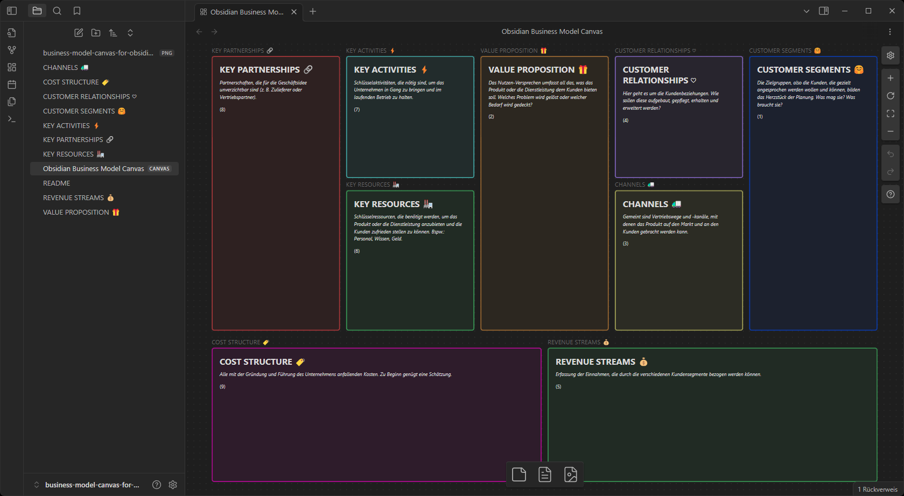

# Business Model Canvas Vorlage für Obsidian

Das Business Model Canvas von [Strategyzer](https://www.strategyzer.com/library/the-business-model-canvas) mit neun Segmenten, nachgebaut für Obsidian.

> [!NOTE]
> This is a fork of the [Business Model Canvas for Obsidian by YJPL](https://github.com/YJPL/business-model-canvas-for-obsidian) with German help texts. If you are a non-german speaker the original template may fit your needs better.

## Voraussetzungen

Um das Canvas verwenden zu können, braucht man die [Obsidian](https://obsidian.md) App.

## Benutzung

Wenn man dieses Repository von GitHub heruntergeladen hat, kann der gesamte Ordner als Vault in Obsidian geöffnet werden. Dazu klickt man (basierend auf Obsidian v1.7) unten auf den aktuellen Vault-Namen und wählt die Option "Manage vaults...". Im darauf folgenden Popup findet man die Option "Ordner als Vault öffnen".

Die Vorlage besteht im Wesentlichen aus einer Reihe von Markdown Dateien für jeweils eins der neun Segmente. Die [.canvas](Obsidian%20Business%20Model%20Canvas.canvas) Datei fügt diese Dateien zusammen. Man kann den Canvas im Ganzen ausfüllen oder die Markdown Dateien einzeln bearbeiten.

Das Business Model Canvas ist gut geeignet zur Vorbereitung eines Businessplans oder zur Verifizierung einer bestehenden Geschäftsidee.
Bei der Planung eines Startups könnte das [Lean Canvas](https://gruenderplattform.de/unternehmen-gruenden/lean-canvas) evtl. besser geeignet sein. Der/die original Autor/-in stellt auch dafür eine [Obsidian Vorlage](https://github.com/YJPL/lean-canvas-for-obsidian) bereit.
